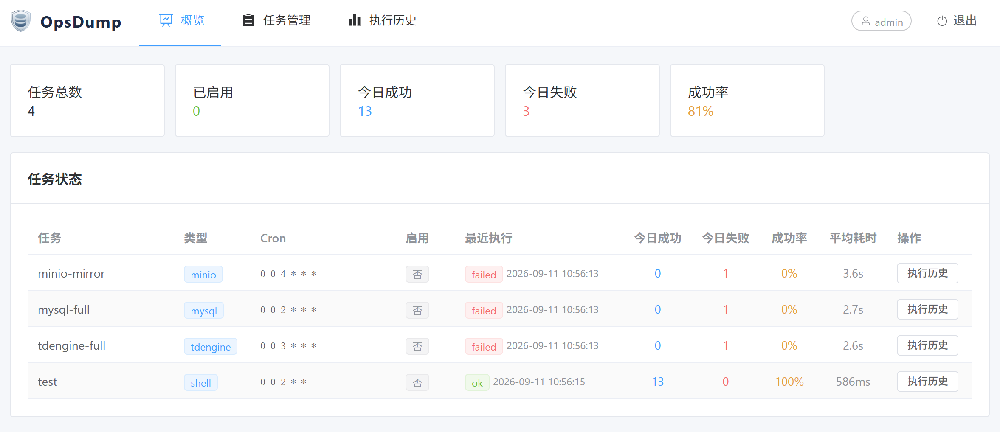
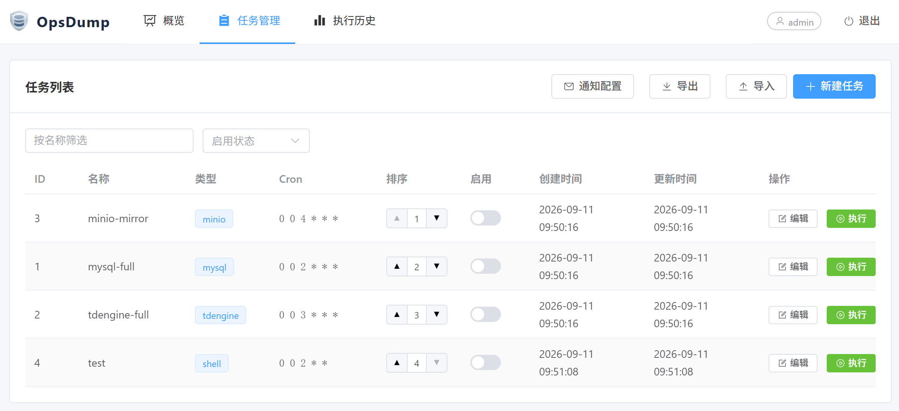
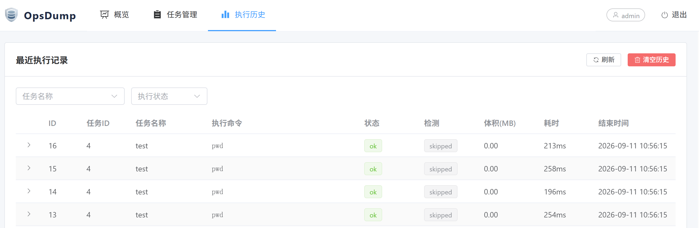

# OpsDump


**极速调度，可靠备份（The Swift Engine for Ops & Dump）**

**OpsDump** 是一个面向**数据库备份为主**、兼有通用任务调度能力的**单进程**运维平台。基于 [GoFrame v2](https://goframe.org) 构建，单二进制、SQLite 落库、Web 页面管理，开机即用。

> 状态：已实现并跑通（v0.1）。仓库根 `ops-dump/` 为可独立运行/迁移的 Go 模块（模块名 `ops-dump`）。

## 仓库地址

- GitHub：<https://github.com/LeapSunrise26/OpsDump>
- Gitee：<https://gitee.com/LeapSunrise/OpsDump>

## 特性

- **数据库备份模板**：内置 MySQL / TDengine / MinIO(S3) 备份模板，**默认禁用**，页面启用后按 cron 自动运行。
- **通用任务调度**：任意本机命令均可作为任务（`kind=shell`），支持 `${VAR}` 引用 `.env`，支持 `ssh` 跨机执行。
- **执行 + 检测双状态**：主命令执行后可选跑一条校验命令，独立记录结果，兜住"假成功"。
- **流水线编排**：通过 `depends_on` 串联 `backup → verify → sync → cleanup`，杜绝"先删后传丢档"。
- **磁盘预检 / 体积上报**：执行前检查输出盘剩余空间，执行后统计产物体积写入历史。
- **Web 管理页面**：gview + Vue3(CDN) 内嵌后台，登录后配置任务、查看执行历史，无需 SSH。
- **任务导出导入**：支持任务配置的批量导出/导入，方便迁移和备份。
- **认证与会话**：账号密码登录，初始 `admin` 账号由 `.env` 的 `ADMIN_PASSWORD` 注入。
- **结构化日志 + 飞书告警**：JSON 行日志，飞书 webhook 通知。
- **探活接口**：`GET /ping → pong`、`GET /healthz`。

## 快速开始

### 1. 准备环境变量

编辑 `.env` 并根据实际情况修改：

```dotenv
# 管理员密码（启动前必须修改！）
ADMIN_PASSWORD=your_password!

# 备份存储路径
BACKUP_DIR=/opt/backups

# MySQL 配置
MYSQL_ROOT_PASSWORD=
MYSQL_HOST=127.0.0.1
MYSQL_PORT=3306
MYSQL_DATABASE=your_database

# TDengine 配置
TDENGINE_ROOT_PASSWORD=
TDENGINE_HOST=127.0.0.1
TDENGINE_PORT=6030
TDENGINE_DATABASE=your_database

# MinIO 配置
MINIO_ROOT_USER=
MINIO_ROOT_PASSWORD=
MINIO_ENDPOINT=127.0.0.1:9000
MINIO_BUCKET=your_bucket
```

> 注意：敏感信息（密码/密钥）仅在此文件中配置，不会进入代码或日志。

### 2. 配置

编辑 `manifest/config/config.yaml`（或自建 `config.yaml` 通过 `--config` 指定）：

```yaml
ops-dump:
  timezone: "Asia/Shanghai"
  dbPath: "./ops-dump.db"
  credentials:
    envFile: ".env"
  admin:
    username: admin
logger:
  path: ./logs
  file: opsdump.log
  level: info
  stdout: true
```

### 3. 运行

```bash
# 开发运行
go run main.go

# 或交叉编译后运行（sqlite 为纯 Go，无 CGO，可静态编译）
GOOS=linux GOARCH=amd64 CGO_ENABLED=0 go build -o ops-dump .
./ops-dump
```

启动后访问 `http://<host>:28090`，用 `admin` 登录，进入任务管理启用/新建任务。

> 注意：首次启动请确保 `ops-dump.db` 不存在，让程序自动创建（Windows 开发机下 gf sqlite 对相对路径解析有特殊处理，生产 Linux 无此问题）。

## 目录结构

```
ops-dump/
├── main.go                     # 入口：调用 internal/cmd 启动并阻塞
├── api/                        # 对外接口 Req/Res 数据结构
├── hack/                       # gfcli 配置与代码生成辅助（gen-db）
├── internal/
│   ├── cmd/                    # 启动引导：配置/日志/DB/调度初始化、注册路由
│   ├── consts/                 # 常量（表名、任务类型、状态等）
│   ├── controller/             # 接口与页面路由实现
│   ├── dao/                    # 数据访问层（gf gen dao 生成）
│   ├── model/                  # entity / do / 公共结构
│   └── service/                # 业务层：env/execute/db/auth/job/tpl/runner/scheduler/notify
├── manifest/
│   ├── config/config.yaml      # 进程配置
│   └── sql/ops-dump.sql        # 建表 DDL（gf gen dao 的 schema 源）
├── resource/                   # 模板(template/) 与静态资源(public/)，随二进制内嵌
└── go.mod / go.sum
```

## 数据模型

全部表以 `od_` 前缀开头，运行时自动建表迁移：

| 表                  | 说明                                                             |
| ------------------ | -------------------------------------------------------------- |
| `od_users`         | 账号（密码 sha256(salt+pwd) 哈希）                                     |
| `od_sessions`      | 会话（预留，当前使用 gf 内存会话）                                            |
| `od_jobs`          | 任务定义（kind/cron/command/verify\_command/run\_after/retention 等） |
| `od_job_runs`      | 执行历史（执行+检测双状态、输出、体积、耗时、错误）                                     |
| `od_notify_config` | 通知配置（飞书 webhook）                                       |

## 主要接口

| 接口 | 说明 |
| --- | --- |
| `GET /ping` | 探活，返回 `pong` |
| `GET /healthz` | 健康检查，返回 JSON |
| `GET /login` | 登录页（公开） |
| `/`、`/dashboard`、`/jobs`、`/runs` | 管理页面（需登录） |
| `POST /api/login` / `POST /api/logout` / `GET /api/current-user` | 认证 |
| `GET/POST /api/jobs`、`GET/PUT/DELETE /api/jobs/:id` | 任务 CRUD |
| `POST /api/jobs/:id/enable`、`disable`、`run`、`GET /api/jobs/:id/runs` | 任务操作 |

## 部署

```bash
nohup ./ops-dump > /dev/null 2>&1 &
```

## 桌面版（Electron）

Windows 桌面版把后端作为 sidecar 子进程托管，双击即用、数据与安装目录隔离，
设计详见 [docs/opsdump-electron-design.md](./docs/opsdump-electron-design.md)。

```bash
# 构建 sidecar（gf pack 内嵌 resource + 交叉编译 windows/amd64，需本机 gf CLI）
make build-windows

# 开发运行（自动 spawn dist/sidecar/ops-dump.exe，pnpm 或 npm 均可）
cd desktop && pnpm install && pnpm start

# 开发时连本机已跑的 go run 实例（不 spawn）
set SIDECAR_EXTERNAL=1&& pnpm start

# 打包 NSIS 安装包（先构建 sidecar，产物在 dist/）
pnpm run dist
```

- 运行数据（`ops-dump.db` / `.env` / `logs`）在 `%APPDATA%\ops-dump-desktop\data\`，
  首次启动生成 `.env`（默认口令 `Opsdump1!`，登录后请尽快修改）。
- 后端仅监听 `127.0.0.1`，端口默认 28090、被占用时自动换端口。
- 国内网络：`pnpm run dist` 已内置 npmmirror 镜像（`hack/build-desktop.ps1` 设置
  `ELECTRON_MIRROR` / `ELECTRON_BUILDER_BINARIES_MIRROR`，已设则沿用）。`pnpm install`
  下载 electron 运行时若失败，先 `set ELECTRON_MIRROR=https://npmmirror.com/mirrors/electron/`
  再装，或装完补 `cd desktop && pnpm electron:fetch`。
- 依赖构建脚本放行配置在 `desktop/pnpm-workspace.yaml`（pnpm 11 的 `allowBuilds`）；
  electron 固定 44.6.0 以满足供应链 24 小时最小发布龄策略。

## 注意事项

- 敏感信息一律 `${VAR}` 引用 `.env`，明文不出库不落地；`.env` 权限 `600`。
- `httpAddr` 建议绑定内网；通用 shell 任务拥有执行权限，需审计。
- 备份产物应与源数据不在同一磁盘；清理任务须排在同步任务之后。

## 软件截图

概览

任务管理

执行历史

