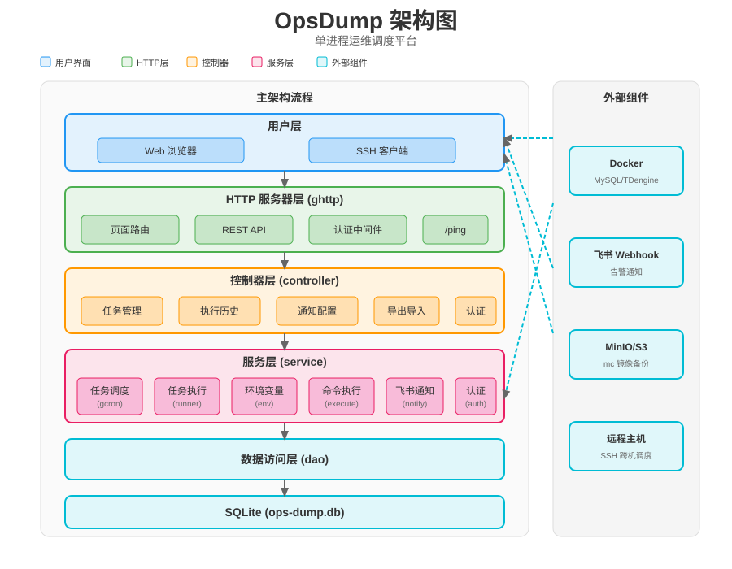

# ops-dump — 通用自动化备份 / 任务调度平台（设计文档）

> 状态：**已实现并验证可用**（v0.1）。本仓库 `ops-dump/` 为可独立运行/迁移的 Go 模块。
> 定位：面向**数据库备份为主**、兼有通用任务调度能力的单进程平台。页面维护任务（执行命令 + 检测命令 + cron + 启停），SQLite 记录执行与检测状态；内置 MySQL / TDengine / MinIO 备份模板（默认禁用），并支持任意本机/跨机命令行任务。
> 运行方式：**单机本地运行**。
>
> 代码已落地：配置加载、SQLite 建表/迁移/种子、账号登录与会话、任务 CRUD、gcron 调度与热加载、手动/定时执行、执行+检测双状态记录、结构化日志、飞书占位通知、`/ping`/`/healthz`、gview 页面均已跑通。

---

## 一、目标与范围

- **DB 备份为主**：MySQL / TDengine / MinIO（及任意 S3 系）备份模板，覆盖执行、检测、保留、空间、分段、同步、清理全链路。
- **通用任务调度**：任何本机命令都可作为任务（`kind=shell`），设置 cron、启停、检测结果；跨机通过 `ssh` 由用户在命令内实现。
- **页面管理**：gview + Vue3 内嵌后台，登录后配置任务、指令、cron、启用状态，无需 SSH。
- **SQLite 记录执行与检测状态**：每次任务记录成功/失败/耗时/体积/输出/检测结果。
- **认证**：账号密码会话登录 + 初始 admin。
- **统一日志 + 飞书告警**；心跳接口 `/ping`。

### 1.1 运行范围（多机怎么处理）

ops-dump **仅支持本地运行**：任务以当前进程用户在本机执行（读取本机 `.env`、调用本机 docker）。

多台 DB 主机（或任务目标主机）的处理方式：本机一个实例，任务命令里用 `ssh 目标机 '...'` 实现跨机执行；敏感信息仍走本机 `.env` 注入。

> 不做中央控制器 / Agent 多节点模型；每个实例都是独立自治的调度平台。

---

## 二、技术选型

| 项 | 选择 | 说明 |
|----|------|------|
| 语言 | Go 1.21+ | 交叉编译单个二进制 |
| 框架 | `github.com/gogf/gf/v2` | 配置、日志、定时（`gcron`）、HTTP（`ghttp`）、模板视图（`gview`）、会话、ORM（`gdb`） |
| 定时 | `gogf/gf/v2/os/gcron` | cron 表达式（**7 位**：`秒 分 时 日 月 周 (年)`），`AddSingleton` 防叠跑 |
| 命令执行 | **原生 `os/exec`**（自封装） | 不用 `gproc`：无 shell 注入、流式输出、env/超时可控；以当前进程用户执行 |
| 存储 | SQLite3，经 gf `gdb` ORM（`github.com/gogf/gf/contrib/drivers/sqlite/v2`，底层 `github.com/glebarez/go-sqlite`，纯 Go 无 CGO） | 任务、执行历史、用户、会话、通知；运行时单文件 `ops-dump.db`；复用 gf ORM 链式查询与自动建表 |
| 代码生成 | `gf gen dao`（gfcli） | 独立 `ops-dump.db`（由 `manifest/sql/ops-dump.sql` 生成）作为 schema 源，配合 `hack/config.yaml`（`prefix: od_`）一键重新生成 `dao/entity/do`，产物与手写 DAO 完全一致 |
| 模板视图 | `resource/template/` gview + Vue3(CDN) | 无独立前端工程，页面随二进制内嵌 |
| 凭据 | `.env` 本地文件，命令 `${VAR}` 运行时注入 | 明文不入库、不进日志 |

> **gproc vs 原生命令**：`gproc.ShellRun` 底层拼 `/bin/sh -c <string>` 有注入面、流控不便；ops-dump 以明确 argv 执行且需 `${VAR}` 注入 env，用原生 `os/exec` 更可控、更安全。

---

## 三、功能总览

| 能力 | 说明 |
|------|------|
| 内置模板 | `mysql` / `tdengine` / `minio`，**默认禁用**，页面启用后按 cron 跑 |
| 通用命令 | `kind=shell` 任意本机命令；支持跨机 `ssh`，形成通用平台 |
| 执行命令 | 任务主指令，支持 `${VAR}` 引用 `.env` |
| 检测命令 | 执行后可再跑一条校验，结果独立入库（兜"假成功"） |
| 保留策略 | `retention_days` 按类型清理旧档 |
| 流水线依赖 | `depends_on` 编排 `backup → verify → sync → cleanup`，保证"先传后删" |
| 磁盘预检 | 执行前检查输出盘剩余空间，防写满半截文件 |
| 体积上报 | 备份后记录包尺寸入 `job_runs`，看板/告警可随访 |
| TDengine 分段 | `kv` 支持时间分段参数化 taosdump |
| 定时调度 | gcron；改 cron/enabled 即时热加载 |
| 认证 | 用户名/密码登录 + 会话；初始 admin |
| 执行历史 | `job_runs` 记录执行+检测双状态、输出、体积、耗时 |
| 心跳/监控 | `GET /ping → pong`；`GET /healthz` |
| 通知 | 飞书 webhook（成功/失败通知配置） |
| 安全 | 命令 `${VAR}` 读 `.env` 注入，明文不出库不落地；本机当前用户执行 |

---

## 四、整体架构



```
ops-dump 守护进程 (single binary, gf 标准布局)
  init: 读 manifest/config/config.yaml → 解析 .env → 打开 SQLite3 → 迁移
         → seed 管理员 → seed 默认禁用三模板
  ├─ ghttp ──
  │   ├ 页面(gview+Vue3)：/ → login → /dashboard /jobs /runs
  │   ├ REST：/api/login|logout|jobs|runs|notify|...
  │   └ 探活：/ping → "pong"；/healthz
  └─ gcron ── 加载 enabled jobs → 按 cron 注册(AddSingleton) → 热加载
       └→ runner：磁盘预检 → 注入 ${VAR} → os/exec(当前用户)
                    → 检测命令 → 记为 job_runs → 结构化日志 → 飞书
```

特点：单进程、单配置、单日志、单告警出口；任务配置 = SQLite 记录，gcron 热加载即时生效；不自动重试（失败即日志+状态+告警，人工介入）。

---

## 五、项目结构与目录

遵循 **GoFrame 官方 SingleRepo 工程目录**（`gf init` 生成）与 **代码分层设计**（`api → controller → service → dao → model`）。独立 Go module，仓库根 `ops-dump/`。

```
ops-dump/
├── main.go                     # 程序入口：调用 internal/cmd 的启动指令并阻塞
├── api/                        # 对外接口：REST 的输入/输出数据结构定义（Req/Res）
│   └── apis.go                 #   LoginReq/Res、JobReq 等（与页面绑定，版本管理 api/v1）
├── hack/                       # 开发工具：gfcli 配置与代码生成辅助
│   ├── config.yaml             #   gfcli 配置（link: sqlite:./ops-dump.db, prefix: od_），供 gf gen dao 使用
│   └── gen-db/                 #   gen-db 小工具：读取 manifest/sql/ops-dump.sql 生成 ops-dump.db（纯 Go，无 CGO）
├── internal/
│   ├── cmd/                    # 入口指令层：解析参数、初始化(配置/日志/DB/认证/调度)、注册路由、启动 server
│   ├── consts/                 # 常量：表名(od_*)、任务类型、状态、默认值等
│   ├── controller/             # 接口实现层：接收 Req、校验、调用 service、封装 Res（含 gview 页面路由）
│   ├── dao/                    # 数据访问层：严格遵循 `gf gen dao` 生成格式（internal/ 内部实现 + 外部每张表一个文件）
│   ├── model/                  # 结构模型层（公共数据结构）
│   │   ├── do/                 #   dao 输入输出领域对象（字段与表一一对应）
│   │   └── entity/             #   数据实体（与数据表一一对应）
│   └── service/                # 业务实现层（按模块拆分）
│       ├── env.go              #   .env 加载/缓存 + ${VAR} 注入
│       ├── execute.go          #   os/exec 本机当前用户执行（流/超时/退出码）
│       ├── db.go               #   gdb(sqlite) 配置、建表迁移、admin/模板 seed
│       ├── auth.go             #   登录/登出/会话/密码哈希
│       ├── job.go              #   任务 CRUD（含 depends_on/保留预检字段）
│       ├── tpl.go              #   内置模板定义（mysql/tdengine/minio，默认禁用）
│       ├── runner.go           #   单任务执行：预检/执行/检测/体积/互斥/补跑
│       ├── scheduler.go        #   gcron 按 cron 注册 + 热加载（改 cron/enabled 即生效）
│       └── notify.go           #   飞书 webhook 通知
├── manifest/
│   ├── config/config.yaml      # 进程配置 + admin 初始账号（config.yaml.example 模板）
│   ├── sql/ops-dump.sql        # 独立建表 DDL（od_ 前缀），供 gf gen dao 的 schema 源
│   └── deploy/                 # （预留）systemd/部署文件
├── ops-dump.db                 # 由 manifest/sql/ops-dump.sql 生成的独立数据库，供 gf gen dao 读取
├── resource/
│   ├── template/               # gview 模板：login/dashboard/jobs/runs.html
│   └── public/                 # css/js(Vue3 CDN)/favicon（静态资源，可随二进制打包）
├── utility/                    # 项目内通用工具（如通用 JSON/时间处理）
└── go.mod / go.sum
```

### 5.1 代码分层与请求流转

遵循 GoFrame 三层架构落地，层次职责与依赖方向：

```
ghttp Server
   ↓ 接收 HTTP 请求，解析参数 → api.Req（绑定+校验）
controller（接口实现层）
   ↓ 业务校验、编排、封装为 api.Res / 渲染 gview
service  （业务实现层，按模块拆分、可复用）
   ↓ 调用 dao，封装业务逻辑与规则（执行/调度/认证/通知）
dao      （数据访问层，gdb ORM，仅最基础 CRUD）
   ↓
SQLite (gdb + sqlite 驱动, 纯 Go 无 CGO)
```

- **api**：存放 `Req/Res` 对外数据结构，与页面/客户端绑定、可版本管理。
- **controller**：接收 `api.Req`，做输入校验与编排；可直接实现或调用一个/多个 service；返回 `api.Res` 或渲染 gview。
- **service**：可复用业务逻辑封装，按模块 `auth/job/runner/scheduler/...` 拆分。业务逻辑放 service 而非 dao。
- **dao**：`gdb` 数据访问收口，保持通用（链式 CRUD），不塞业务逻辑；文件严格遵循 `gf gen dao` 产物格式，可配合 `manifest/sql/ops-dump.sql` + `hack/config.yaml` 一键重新生成。
- **model**：`entity`（表一一对应）+ `do`（dao 输入输出）+ 公共结构；不直接暴露给外部接口。
- **cmd**：启动引导，注册依赖注入/初始化顺序，绑定路由，启动并阻塞 server。

> 页面（gview）与 REST API 同属 controller 层；静态资源放 `resource/public`，模板放 `resource/template`，均随二进制内嵌发布。

---

## 六、SQLite 数据模型

> 全部表名以 **`od_`** 前缀开头（`od_users` / `od_sessions` / `od_jobs` / `od_job_runs` / `od_notify_config`）。
> 运行时由 `internal/service/db.go` 的 `schemaStatements` 自动建表迁移；同时提供独立 `manifest/sql/ops-dump.sql` 作为 `gf gen dao` 的 schema 源，配 `hack/config.yaml`（prefix `od_`）可一键重新生成 `dao/entity/do`。
> 完整的数据库 Schema 参见 `docs/ops-dump-schema.sql`。

```sql
CREATE TABLE od_users (
  id INTEGER PRIMARY KEY AUTOINCREMENT,
  username TEXT NOT NULL UNIQUE,
  password_hash TEXT NOT NULL,              -- sha256(salt + ":" + pwd) 哈希
  display_name TEXT,
  enabled INTEGER NOT NULL DEFAULT 1,
  created_at TEXT NOT NULL, updated_at TEXT NOT NULL
);
CREATE TABLE od_sessions (
  id TEXT PRIMARY KEY, username TEXT NOT NULL,
  expires TEXT NOT NULL, created_at TEXT NOT NULL
);
CREATE TABLE od_jobs (
  id INTEGER PRIMARY KEY AUTOINCREMENT,
  name TEXT NOT NULL UNIQUE,
  kind TEXT NOT NULL,                       -- mysql | tdengine | minio | shell
  enabled INTEGER NOT NULL DEFAULT 0,       -- 模板默认禁用
  cron TEXT NOT NULL,                       -- gcron 6 位表达式（秒 分 时 日 月 周，可选第 7 位年）
  depends_on TEXT,                          -- 前一任务名（先执行之；其成功后本任务才跑），用于流水线 backup→verify→sync→cleanup
  description TEXT,
  container TEXT, database TEXT,
  command TEXT,                             -- 执行命令，支持 ${VAR}
  verify_command TEXT,                      -- 检测命令，支持 ${VAR}（可选）
  min_free_mb INTEGER NOT NULL DEFAULT 2048,-- 磁盘预检阈值(MB)
  out_dir TEXT, retention_days INTEGER NOT NULL DEFAULT 7,
  kv TEXT,                                  -- 扩展参数 JSON（threads/network/buckets/分段/加密/retry 等）
  created_at TEXT NOT NULL, updated_at TEXT NOT NULL
);
CREATE TABLE od_job_runs (
  id INTEGER PRIMARY KEY AUTOINCREMENT,
  job_id INTEGER NOT NULL,
  status TEXT NOT NULL,                     -- running | ok | failed | skipped
  started_at TEXT NOT NULL, finished_at TEXT,
  elapsed_ms INTEGER,
  exit_code INTEGER, error TEXT,            -- 失败原因（执行/检测/依赖/预检），便于页面排查
  output TEXT,                              -- 执行命令输出(截断 4096)
  verify_status TEXT,                       -- ok | failed | skipped
  verify_output TEXT,
  size_mb REAL,                             -- 备份产物体积(上报)
  disk_free_mb REAL,                        -- 执行前磁盘剩余(预检)
  created_at TEXT NOT NULL
);
CREATE INDEX idx_runs_job ON od_job_runs(job_id, started_at DESC);
CREATE TABLE od_notify_config (
  id INTEGER PRIMARY KEY AUTOINCREMENT,
  channel TEXT NOT NULL DEFAULT 'feishu',
  enabled INTEGER NOT NULL DEFAULT 1,
  config TEXT NOT NULL,                     -- JSON：webhook、on_failure_only
  updated_at TEXT NOT NULL
);
```

---

## 七、认证设计

- **登录**：`POST /api/login`（用户名+密码）→ 校验 `od_users.password_hash`（sha256(salt+密码)）→ 建 gf session cookie。
- **中间件**：白名单 `/login`、`/ping`、`/healthz`；其余页面与 `/api/*` 需登录（未登录重定向 `/login` 或返回 401）。
- **登出**：`POST /api/logout` 销毁会话。
- **初始 admin**：SQLite 首次初始化且 `od_users` 为空时，读取 `.env` 的 `ADMIN_PASSWORD` 作为密码 seed 用户 `admin`。密码以 sha256(salt+密码) 哈希入库。
- 会话默认由 gf 会话存储（内存态）保管。

---

## 八、内置备份模板（做深做强）

首次启动 seed 三模板，均 `enabled=0`；命令中密码/连接信息用 `${VAR}` 引用 `.env`，容器名、库名等由任务配置或 `.env` 提供。

> 命令统一约定：凡涉及主机/容器/库/凭据一律写成 `${VAR}` 或 job 字段，样例仅作说明。

### 8.1 MySQL 全量模板（kind=mysql）

```
执行（容器内 mysqldump，流式 gzip）：
docker exec <container> mysqldump --single-transaction --quick --routines --triggers
        --events --set-gtid-purged=OFF --default-character-set=utf8mb4
        -uroot -p${MYSQL_ROOT_PASSWORD} --databases <database>
  输出流式 gzip → <out_dir>/mysql_full_YYYYMMDD.sql.gz
检测：gzip -t 校验 + 产物非空
依赖：${MYSQL_ROOT_PASSWORD}；binlog 常开、不归档（按需 PITR）
```

### 8.2 TDengine 全量模板（kind=tdengine）

```
执行：
docker exec <container> taosdump -h localhost -P 6030 -uroot -p${TDENGINE_ROOT_PASSWORD}
        -o /tmp/taos_backup_YYYYMMDD -T <threads> -D <database>
docker cp <container>:/tmp/taos_backup_YYYYMMDD/. <out_dir>/<database>_YYYYMMDD/
docker exec <container> rm -rf /tmp/taos_backup_YYYYMMDD
检测：输出目录文件数非空
依赖：${TDENGINE_ROOT_PASSWORD}（兜底 default）；分段：kv.range_start/range_end 时按 -S/-E 时间区间调
```

### 8.3 MinIO / S3 镜像模板（kind=minio）

```
执行（本地 mc 镜像，要求宿主机已安装 mc）：
mc alias set <alias> <endpoint> "${MINIO_ROOT_USER}" "${MINIO_ROOT_PASSWORD}" 2>/dev/null || true
mc mirror --overwrite <alias>/<bucket> <out_dir>/<bucket>
检测：输出目录 bucket 镜像对象数非空
依赖：宿主机安装 mc；${MINIO_ROOT_USER}/${MINIO_ROOT_PASSWORD}；默认覆盖式，kv.snapshots=true 保留历史快照
```

### 8.4 DB 备份增强设计（落库/执行层）

| 项 | 设计 | 落点 |
|----|------|------|
| **流水线依赖** | `depends_on`：cleanup 排在 sync 之后，杜绝"先删后传丢档"；全链 backup→verify→sync→cleanup | `jobs.depends_on` + scheduler 先跑依赖再跑本任务 |
| **磁盘预检** | 执行前检查 `out_dir` 所在盘剩余空间 ≥ `min_free_mb`，不足直接 failed 并告警 | runner 前置于执行；`job_runs.disk_free_mb` |
| **体积上报** | 备份后统计产物尺寸写入 `job_runs.size_mb` | runner 后置；看板/告警随访趋势 |
| **TDengine 分段** | `kv.(range_start/range_end)`、分段数量，拆多段 taosdump | tpl/tdengine |
| **异地同步 job** | 把 rsync/上传做成 `kind=shell` 任务，接在 backup+verify 后（depends_on） | 模板/页面 |
| **保留清理 job** | 清理用独立步骤放在 sync 成功之后 | 模板/页面 |
| **冷备兜底(可选)** | `kind=shell`：停止容器后 tar 数据目录，作为兜底 | 模板/页面 |
| **加密(可选)** | `kv.encrypt=age|gpg`，同步前加密、异地明文不泄露 | execute 层 |
| **自动重试(可选)** | `kv.auto_retry=1` 时失败补跑 1 次（默认关闭） | runner |

> 校验/检测、保留、串行锁为硬性项；分段/冷备/加密/自动重试为可选开关，默认关闭。

### 8.5 通用 shell 模板（kind=shell）

直接编辑 `command` / `verify_command` 任意本机命令（支持 `${VAR}`、支持 `ssh 目标机 ...` 跨机）。内置三模板由它驱动，用户可建任意新任务。

---

## 九、执行与检测流程

```
gcron 触发(AddSingleton) 或 页面手动触发
 → 校验 depends_on 前置项已成功，否则跳过
 → 磁盘预检(≤min_free_mb 直接 failed)
 → 写 job_runs.status=running
 → 注入 ${VAR}(读 .env) → os/exec 当前用户执行 → 记 output/exit_code/elapsed
 → 统计产物体积 → size_mb
 → 配置了 verify_command 则执行检测 → verify_status/output
 → 更新 job_runs(status/verify/size/disk_free)
 → 失败或检测失败 → 结构化日志 + 飞书
 → (可选 kv.auto_retry=1) 失败补跑 1 次
```

要点：
- **仅本机、以当前进程用户执行**；`ssh` 跨机时凭据/逻辑由用户在命令内负责。
- `${VAR}` 引用值只注入子进程 env，日志打印用 `${VAR}` 占位，明文不落地。
- 串行/错峰由 cron 决定；流水线用 `depends_on` 编排。

---

## 十、页面（gview + Vue3 CDN）

| 页面 | 模板 | 说明 |
|------|------|------|
| 登录 | login.html | 用户名/密码 → 会话 |
| 概览 | dashboard.html | 各任务今日成功/失败/待跑、最近体积趋势 |
| 任务管理 | jobs.html | 增删改：kind/执行命令/检测命令/cron/depends_on/enabled/保留/预检阈值；启用即热加载 |
| 执行历史 | runs.html | job_runs 执行+检测双状态、输出、体积、耗时、错误 |

---

## 十一、结构化日志与告警

统一 JSON 行（gf glog + JSON）：

```json
{"ts":"2026-08-26T02:00:01+08:00","level":"info","job":"mysql-full",
 "runId":12,"kind":"mysql","exec":"ok","verify":"ok","sizeMB":845,"diskFreeMB":51200}
{"ts":"2026-08-26T02:10:31+08:00","level":"error","job":"mysql-full",
 "runId":12,"kind":"mysql","exec":"fail","error":"mysqldump exit 1: out of memory","elapsedSec":630}
```

- 飞书通知：从 `notify_config` 读取 webhook 与通知策略，支持成功/失败通知配置。
- 不自动重试：失败即日志 + `job_runs` + 飞书；可页面/`POST /api/jobs/:id/run` 补跑，或开 `auto_retry=1`。

---

## 十二、基础接口

- `GET /ping` → `pong`；`GET /healthz` → JSON（含 version）。
- 页面（gview，需登录）：`GET /`、`/dashboard`、`/jobs`、`/runs`；`GET /login`（公开）。
- `POST /api/login` / `POST /api/logout` / `GET /api/current-user`。
- `GET/POST /api/jobs`；`GET/PUT/DELETE /api/jobs/:id`；`POST /api/jobs/:id/enable`、`POST /api/jobs/:id/disable`、`POST /api/jobs/:id/run`；`GET /api/jobs/:id/runs`。
- 任务导出导入：`GET /api/jobs/export`（导出任务）、`POST /api/jobs/import`（导入任务）。
- 通知配置：`GET/PUT /api/notify`（飞书 webhook 配置管理）。

---

## 十三、备份产物与恢复通则

### 13.1 备份产物目录（示例，可配置）
```
<backups_dir>/
├── mysql/full/ | meta/
├── tdengine/<database>_YYYYMMDD/
├── minio/<bucket>/...
└── logs/
```

### 13.2 MySQL 恢复
```bash
# FLUSH TABLES WITH READ LOCK → 恢复 → UNLOCK TABLES
gunzip < <out>/mysql_full_YYYYMMDD.sql.gz | docker exec -i <container> mysql -uroot -p"$MYSQL_ROOT_PASSWORD"
```
PITR 按需用 binlog（`docker exec <container> mysqlbinlog --start-position/--stop-datetime`），binlog 常开不归档。

### 13.3 TDengine 恢复
```bash
docker cp <backups>/<database>_YYYYMMDD <container>:/tmp/taos_restore
docker exec <container> taosdump -h localhost -P 6030 -uroot -p"$TDENGINE_ROOT_PASSWORD" -i /tmp/taos_restore -T <threads>
```
恢复新库名加 `-W`；WAL 超限加 `-B 10000`。

### 13.4 MinIO 恢复
```bash
mc alias set <alias> <endpoint> "$MINIO_ROOT_USER" "$MINIO_ROOT_PASSWORD" 2>/dev/null || true
mc mirror --overwrite <out_dir>/<bucket> <alias>/<bucket>
```

### 13.5 异地同步（可选，强烈建议）
作为 `kind=shell` 任务接在 backup+verify 后（`depends_on`），rsync 到独立磁盘/远机，**清理任务在 sync 成功之后**。
> 备份不能与源数据同一磁盘。

---

## 十四、部署与运维

### 14.1 构建（开发机交叉编译）
```bash
GOOS=linux GOARCH=amd64 CGO_ENABLED=0 go build -o ops-dump .
# sqlite 驱动(经 gf contrib)为纯 Go，可静态编译无 glibc
```

### 14.2 前期：nohup 启动
```bash
mkdir -p /opt/ops-dump
cp ops-dump manifest/config/config.yaml /opt/ops-dump/
# 编辑 config.yaml（dbPath/logDir/.env 路径/httpAddr/admin）
nohup /opt/ops-dump/ops-dump --config /opt/ops-dump/config.yaml \
      >> /opt/ops-dump/logs/ops-dump-daemon.out 2>&1 &
echo $! > /opt/ops-dump/ops-dump.pid
```
- 日志 `tail -f ops-dump.log`；探活 `curl :28090/ping` → `pong`；需对 docker 有执行权限（root 或 docker 组）。

### 14.3 升级到 systemd（后续可选）
```ini
[Unit]
Description=ops-dump
After=docker.service
[Service]
ExecStart=/opt/ops-dump/ops-dump --config /opt/ops-dump/config.yaml
Restart=always
User=root
WorkingDirectory=/opt/ops-dump
[Install]
WantedBy=multi-user.target
```

### 14.4 跨机调度
- **SSH 免密跨机**：本机任务用 `ssh user@目标机 '...'`（需配置 SSH key）。

---

## 十五、验证计划（编码后）

1. **单测**：SQLite（迁移、CRUD、admin seed）、`execute`（`${VAR}`、超时、退出码）、检测、磁盘预检、保留清理。
2. **认证**：登录/登出、未登录拦截。
3. **模板**：三模板默认禁用，启用后手动触发跑通，检测通过。
4. **流水线**：`depends_on` 按 backup→verify→sync→cleanup 顺序，cleanup 未同步不删。
5. **干跑**：`--dry-run` 仅打印命令。
6. **端到端演练**：定期在测试环境恢复抽查。

---

## 十六、故障场景速查

| 场景 | 处置 |
|------|------|
| 任务失败（飞书告警） | 查 job_runs/日志；修复后页面补跑 |
| 无法登录 | 确认 admin seed 与 ADMIN_PASSWORD 配置正确 |
| 磁盘空间不足被拒 | 清理旧档或调 min_free_mb |
| 守护进程未跑 | curl :28090/ping；nohup/systemd 拉起 |
| 备份恢复 | 见 §13 |

---

## 十七、注意事项与最佳实践

1. **敏感信息**：命令一律 `${VAR}` 引用 `.env`，明文不出库不落地；`.env` 权限 `600`。
2. **安全边界**：`httpAddr` 建议绑内网；通用 shell 有 docker 权限需审计（job_runs 记录谁触发/何时/结果）。
3. **时间一致**：服务器 NTP 校准，保证 cron 与 PITR 一致。
4. **磁盘监控**：backups/ 与 SQLite 磁盘占用告警（healthz/日志）。
5. **演练即保障**：备份能否恢复靠实际演练。
6. **防叠跑**：cron 用 AddSingleton，手动触发加互斥。
7. **保留晚于同步**：cleanup 用 depends_on 排在 sync 后，防"先删后传丢档"。

---

## 十八、后续待办 / 开放项

- [ ] 生产后 nohup → systemd。

### 18.1 实现注记（与设计的差异点）

- **DAO 严格按 `gf gen dao` 格式产出**：`internal/dao/internal/*.go` 为内部实现（含 `XxxDao`/`XxxColumns`/`NewXxxDao(handlers ...)`），`internal/dao/*.go` 为每张表一个外部文件（导出变量 `Users/Jobs/Sessions/JobRuns/NotifyConfig`）。修改表结构后执行 `go run ./hack/gen-db && gf gen dao -cfg ./hack/config.yaml` 即可重新生成，无需手改。
- **配置加载**：`g.Cfg().MustGet(ctx,"")` 在 gf 中返回空，故 `internal/cmd/cmd.go` 改为按 `app/logging/credentials/admin` 各 section 分别读取并 `gconv.Struct` 注入。
- **静态资源**：`/public/*` 由 `s.AddStaticPath("/public","resource/public")` 显式注册（config 内 `staticPaths` 在部分环境下未被 ghttp 解析，故代码内注册更稳）。
- **跨平台执行**：`os/exec` 在 Linux 用 `/bin/sh -c`，Windows 开发机自动降级为 `cmd /c`（生产目标为 Linux）。
- **Windows 开发机数据库路径注意**：gf sqlite 驱动会用 `gfile.Search` 把已存在的相对路径解析成绝对 Windows 路径（含 `:`），导致打开失败；**首次启动请确保 `ops-dump.db` 不存在**让其自动创建，或改用绝对路径（生产 Linux 无此问题）。